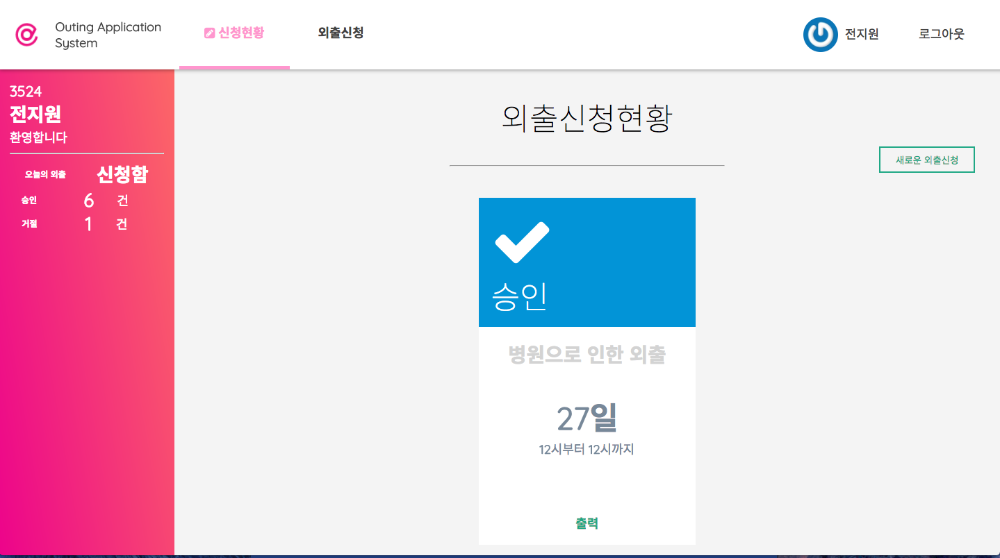

# OAS
`Outing Application System` in *DIMIGO*

> 이 애플리케이션은 한국디지털미디어고등학교 학생들의 외출 편의를 위해 2015년 기획된 프로젝트입니다. 
온라인 상에서 학생들이 외출을 신청하고, 교사가 승인할 경우 교무실에서 POS 프린터를 통해 외출증을 인쇄해가는 방식입니다.  
 
2015년 당시 php 기반으로 작성되었으나, 2017년에 Ruby on Rails 프레임워크 기반의 프로젝트로 다시 개발되었습니다.

### Preview
